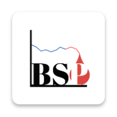
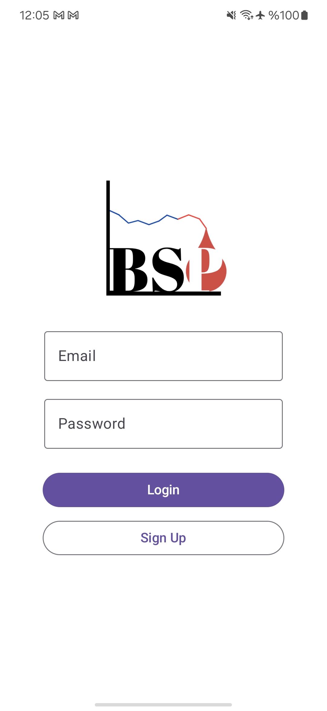
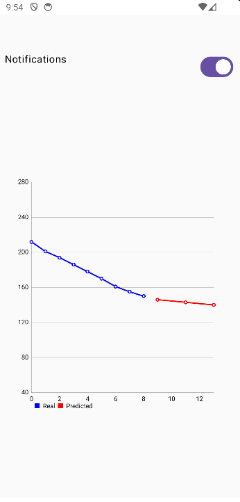
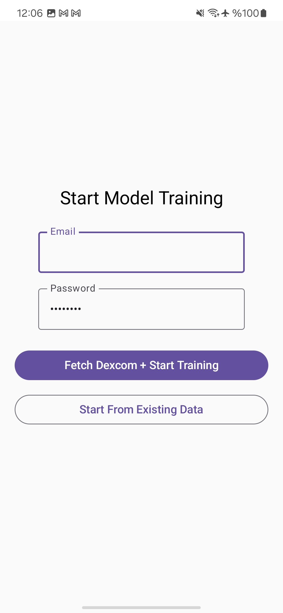

# BSP Android App – Blood Sugar Prediction & Monitoring

<p align="center">
  
</p>

<p align="center">
  <b>The official Android companion app for real-time blood sugar predictions.</b><br>
  Powered by a patent-pending backend and machine learning pipeline.
</p>

---

## 🚀 **Overview**

The **BSP Android App** connects to a powerful backend that predicts short-term blood glucose trends using advanced machine learning models.  
It offers:
- **Fast, near-real-time inference** for trend visualization.
- **Automatic background fetch** every 15 minutes.
- A **clean, modern UI** built with Jetpack Compose.

> ⚠ **Disclaimer:** This app is for **research and educational purposes only** and does not provide medical advice.

---

## ✨ **Key Features**

- **📊 Predictive Visualization:** 12 past glucose values with 3 predicted values ahead.  
- **⚡ Optimized API Calls:** Smart logic prevents redundant inference requests.  
- **🎨 Minimalist UI:** Custom splash logo, off-white theme, and smooth animations.  
- **🔔 Alerts & Notifications:** Background fetches alert the user of potential risks.  
- **📱 Native Performance:** Built with Kotlin and Jetpack Compose for smoothness.

---

## 🌟 **Backend Advantages & Use Cases**

### **What Makes the Backend Special**
- **Patent-Pending ML Pipeline:** Custom recurrent models designed specifically for time-series blood glucose prediction.
- **High-Performance Inference:** Optimized AWS Lambda containers running ONNX/TensorFlow backends for sub-second predictions.
- **Redundancy Avoidance:** Timestamp-based caching logic prevents wasteful calls while ensuring fresh results.
- **Modular & Cloud-Native:** Built with AWS SageMaker, S3, and Lambda for seamless scaling.

### **Potential Use Cases**
- **Early Warnings:** Predict low or high glucose events before they occur, allowing preemptive action.  
- **Personalized Predictions:** Models trained on individual user data for better accuracy.  
- **IoT Integration:** Future potential to integrate with wearable devices (smartwatches, fitness trackers).  
- **Health Data API:** Could be expanded to support other metrics like activity levels or insulin dosing.

### **Advantages Over Traditional Apps**
- **Real-Time + Predictive:** Unlike static CGM apps, BSP forecasts trends, not just displays data.  
- **Cloud-Driven Efficiency:** No need for local heavy computation — everything is optimized in the cloud.  
- **Privacy-Focused:** Backend logic and models remain private (black box), ensuring security.

---

## 🖼 **Screenshots & Demo**

### **Splash / Login**


### **Prediction Dashboard**


### **Sign-Up**


---

## 🛠 **Tech Stack**


---

## ⚡ **Getting Started**

### **Prerequisites**
- **Android Studio** (latest version).
- **Java 17+** or equivalent JDK.

### **Steps**
```bash
git clone https://github.com/<your-username>/bsp-android.git
cd bsp-android
````

Open the project in **Android Studio**, sync Gradle, and run on an emulator or connected device.

---

## 🌐 **APK Download**

You can download the latest debug APK from the [**Releases Section**](https://github.com/atakan-kaya35/bsp-android/releases).

---

## 📂 **Repository Structure**

```
bsp-android/
├── app/
│   ├── src/
│   │   ├── main/
│   │   │   ├── java/com/ataka/bspapp   # App source code
│   │   │   ├── res/                     # UI resources (logo, drawables)
│   │   │   └── AndroidManifest.xml
│   │   └── ...
└── build.gradle                         # Project build configuration
```

---

## 📜 **License**

This project is proprietary.
Contact **\[atakanka350@gmail.com]** for collaboration inquiries.

---

<p align="center">
  Made by <b>Atakan Kaya.</b>
</p>
```
